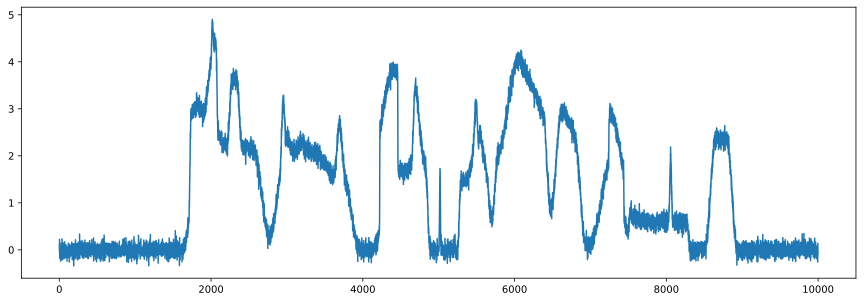
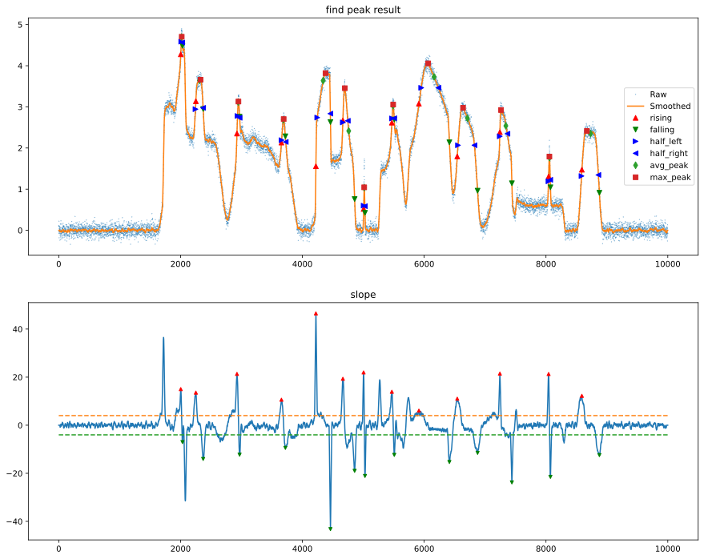
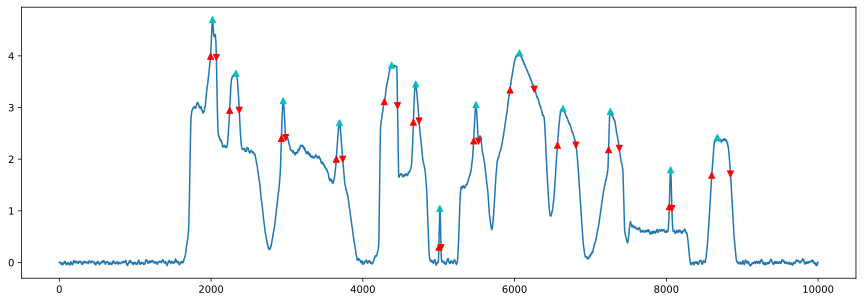

```python
%matplotlib inline
import simulate
import find_peak_slope
import find_peak_value
import numpy as np
import matplotlib.pyplot as plt 
```


```python
sp = simulate.random()
plt.figure(figsize=(15,5))
plt.plot(sp)
plt.show()
```





```python
# find peak by slope
slope_th = 4
sm,dsp,rising_edge,falling_edge,avg_frq,max_frq,dev_band,half_left,half_right,half_band = find_peak_slope.find_peak_slope(sp,21,slope_th)
find_peak_slope.plot_all(sp,sm,dsp,slope_th,rising_edge,falling_edge,avg_frq,max_frq,dev_band,half_left,half_right,f=1,origin=None)
```





```python
# find peak by band
band_th = 0.7
x = sm
rising_edge,falling_edge,maxloc = find_peak_value.FindBandByValue(x,band_th)
plt.figure(figsize=(15,5))
plt.plot(x)
plt.plot(rising_edge,x[rising_edge],'r^')
plt.plot(falling_edge,x[falling_edge],'rv')
plt.plot(maxloc,x[maxloc],'c^')
plt.show()
```





```python

```
